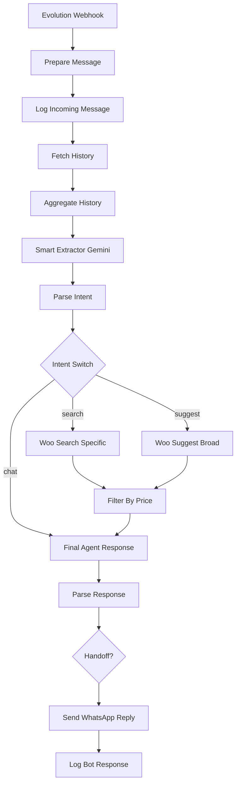

# Laapak Smart Search Workflow Documentation

The **Laapak Smart Search Workflow** is an n8n-based automation that powers an AI shopping assistant for Laapak on WhatsApp. It handles incoming messages, classifies user intent, searches for products in WooCommerce, and generates natural language responses in Egyptian Arabic using Google Gemini.

## Workflow Overview

## Detailed Node breakdown

### 1. Ingestion & Preprocessing
- **Evolution Webhook**: Listens for `POST` requests at `/evolution/wa-message`. Receives real-time messages from the Evolution WhatsApp API.
- **Prepare Message**: A JavaScript node that filters out group messages and bot-sent messages. It extracts the core text and sender information (`jid`).
- **Log Incoming Message**: Saves the user's message into the `whatsapp_messages` table in MySQL for history and auditing.

### 2. Contextualization
- **Fetch History**: Retrieves the last 10 messages from the database.
- **Aggregate History**: Combines the retrieved messages into a single string (e.g., "العميل: سعر؟, فريق Laapak: 100") to provide the AI with full conversation context.

### 3. Intent Analysis & Categorization (AI)
- **Smart Extractor (Gemini 2.5 Flash Lite)**: Analyzes the message and chat history.
  - **Intent**: Classifies into `search`, `suggest`, or `chat`.
  - **Category Mapping**: Maps requests to specific WooCommerce category IDs.
  - **Price Extraction**: Extracts `max_price` if the user mentions a budget.
- **Parse Intent**: Cleans the AI's JSON output for reliable routing and filtering.

### 4. Search & Logic
- **Intent Switch**: Routes the flow based on the detected intent.
- **Woo Search Specific**: Queries the WooCommerce API for products matching the extracted keywords.
- **Woo Suggest Broad**: Queries WooCommerce for category-based suggestions.
- **Filter By Price**: A JavaScript node that filters the WooCommerce results based on the `max_price` extracted by the AI.

### 5. Response Generation (AI)
- **Final Agent Response (Gemini 2.5 Flash)**: 
  - **Persona**: Named "Bakiza" (بكيزة), a professional but friendly Egyptian tech sales assistant.
  - **Language**: Natural Egyptian Arabic.
  - **Context**: Includes filtered Product Context, Chat History, and User Message.
  - **Strict Rules**: Max 4 lines, must include product links, set `handoff=true` if buying intent is detected.

### 6. Delivery & Cleanup
- **Send WhatsApp Reply**: sends the final text (extracted from AI JSON) to the user via Evolution API.
- **Log Bot Response**: Records the assistant's reply in MySQL.

## Key Technical Details

| Detail | Value |
| :--- | :--- |
| **API Endpoint** | `https://wa.fixzzone.com/message/sendText/Laapak` |
| **Model (Extractor)** | `gemini-2.5-flash-lite` |
| **Model (Agent)** | `gemini-2.5-flash` |
| **Database** | MySQL (`laapak_automation`) |
| **Persona** | Bakiza (لابك - بكيزة) |

## Related Files
- `Laapak Smart Search Workflow.json`
- `workflow_debug.json`
